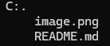

# MoliPollito

El restaurante MoliPollito desea modernizar la forma en la que se gestionan los pedidos de las mesas del restaurante, para esto ha analizado su operación y ha levantado los requerimientos para el nuevo sistema.

## Descripción

La página consta de ciertas especificaciones las cuales son:

1. Permitir la creación de pedidos para un cliente añadiendo los platos que solicite separándolos por entradas, platos fuertes y bebidas. Los pedidos serán almacenados en un archivo tipo JSON.
2. Los pedidos pueden agregar tantos platos y opciones como se soliciten, permitiendo la repetición de los mismos.
3. Registrar los pagos hechos por pedido en formato JSON. El pedido deberá contener la información si fue pagado o no, el pago se puede realizar en cualquier momento. Al pagarse debe registrar en un archivo la fecha de pago, el valor total (que en ese momento deberá ser calculado) y el identificador del cliente línea a línea sin eliminar nunca ningún registro.

## Tecnologías utilizadas 

| Python |
|--|
||

## Estructura del proyecto

Aqí podras observar todo lo utilizado para desarrollar el proyecto:

## Caracteristíca 

* Archivo [MoliPollito.py]:Consta del código principal del proyecto.
* Archivo [json]:Consta de los recursos necesarios para desarrollar el proyecto.
* Archivo [README.md]:Documentación de la estructura del código principal.

## Diseño 
El diseño se realizo con el fin de que la página pueda ser utilizada por cualquier usuario y la pueda entender.

## Instrucciones 
1. Clonar el repositorio cargado en GitHub.
2. Abrir en la nube el archivo Python.

## Desarrollado por 
Realizado por Yessica Andrea Perez Machuca estudiante de Campuslands como trabajo de práctica en el módulo Git.
